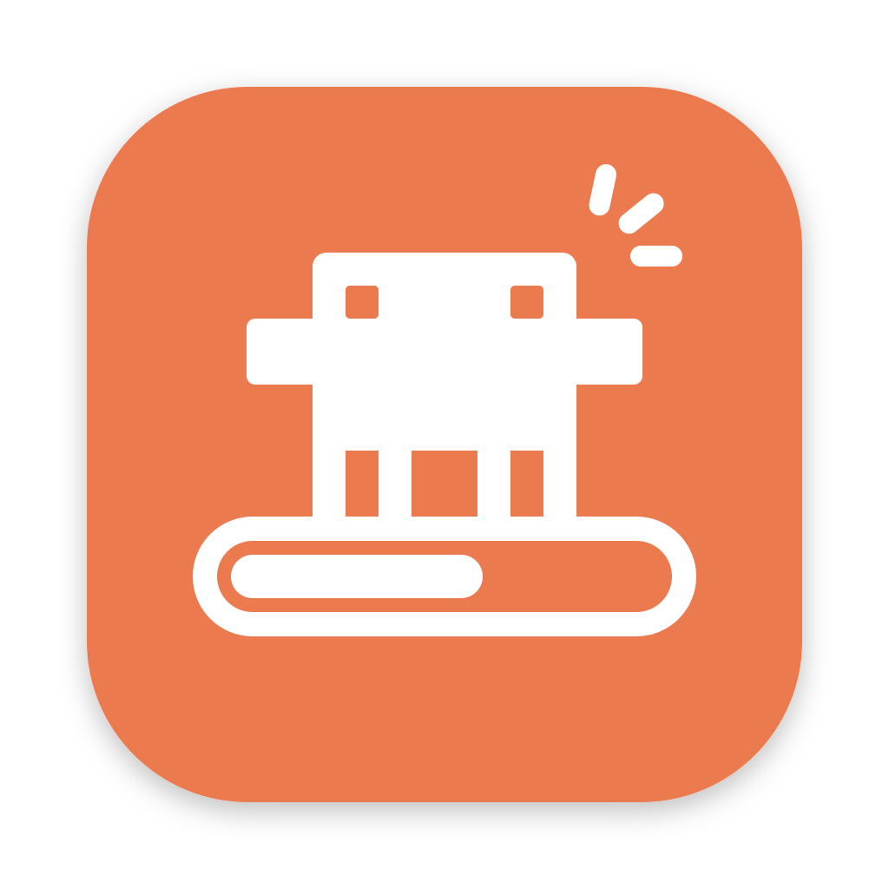

<h1 align="center">
  
  <br>
  Context Band
  <br>
</h1>

<p align="center">
  Claude Code 的一个 mod:在输入框上方加一条带,<b>上下文天气</b>、<b>额度</b>和<b>进度</b>一眼看完。
</p>

<p align="center">
  <a href="./LICENSE"></a>
</p>

---

## 它画什么

带分三层,行多了往上长,仪表永远在最下面。

**仪表(最下面一行)**

- **上下文的「天气」**:窗口用了多少就是哪一档,旁边是用量、窗口大小和百分比。

  | 档     | 用了多少  |
  | ------ | --------- |
  | 晴朗   | 不到 25%  |
  | 多云   | 25% – 50% |
  | 阵雨   | 50% – 75% |
  | 雷暴   | 75% – 90% |
  | 龙卷风 | 90% 以上  |

- **最近 12 轮**:每一轮让窗口涨了多少,一轮一根柱子。
- **两个额度窗口**:5 小时(怀表)和本周(值班表),各自用掉百分之几、还剩多久重置。不走订阅的账号没有这两格。

**进度行(仪表上面,一件活一行)**

Claude 用 mod 带的工具报上来的。四种状态各有图标:

| 状态     | 图标   |
| -------- | ------ |
| 勘察阶段 | 放大镜 |
| 工作中   | 齿轮   |
| 等你拍板 | 服务铃 |
| 做完了   | 对勾   |

**子代理行(最上面)**

派出去的子代理各占一行,写着它用了几个工具轮、跑了几分钟。

图形只在干活的时候动。服务铃是例外:它会一直摇到你回话。

终端里画不了图,同样的内容各画成一行字。

## 安装

需要带 mods(函数钩子插件)的 Claude Code。

三种装法,选一种就行,别同时装两份。

**从插件市场装**:这个仓库自己就是一个只有它一个插件的市场。

```bash
claude plugin marketplace add Akokk0/claude-context-band
claude plugin install context-band
```

**克隆到 skills 目录**,下个会话起自动加载:

```bash
git clone https://github.com/Akokk0/claude-context-band.git ~/.claude/skills/context-band
```

**只在某一次会话里用**:

```bash
claude --plugin-dir /path/to/claude-context-band
```

装好之后不用再配什么,也不用装依赖:仓里的 `package.json` 只管开发时的门禁,mod 自己没有第三方依赖。mod 会自己把「怎么报进度」的说明带进对话,Claude 做多步的活时就会去报。

## Claude 怎么报进度

mod 注册了一个工具 `mcp__context-band__progress`:

| 入参     | 说明                                                                                  |
| -------- | ------------------------------------------------------------------------------------- |
| `plan`   | 这件活的标识,同一件活每次都用同一个                                                   |
| `title`  | 行上显示的标题,十个字以内                                                             |
| `phases` | 按顺序的各个阶段,每个有 `name` 和 `steps`(几步);只看不改的勘察类阶段加 `survey: true` |
| `done`   | 一共做完了几步,跨阶段累计                                                             |
| `status` | 一般不用传,由步数推;停下来等人决定时传 `decide`                                       |
| `remove` | 传 `true` 把这一行撤掉                                                                |

胶囊上的数字是 mod 算的,数的是**做完的**,刚开工是 0:

| 阶段怎么列                  | 胶囊显示                                       | 例子       |
| --------------------------- | ---------------------------------------------- | ---------- |
| 只有一个阶段                | 做完几步 / 共几步                              | 切片 9/18  |
| 好几个阶段,眼下这个只有一步 | 做完几个阶段 / 共几个阶段                      | 2期 1/7    |
| 好几个阶段,眼下这个还分步   | 做完几个阶段.眼下这个阶段做完几步 / 共几个阶段 | 施工 1.2/3 |

带不带小数只看眼下这个阶段:同一行走到只有一步的阶段时是「门禁 2/4」,走到分步的阶段时是「文档 1.1/4」。

几条规矩:

- 先报的行在下,后报的在上。一件大工程可以报三条:整个工程、当前这个大阶段、手上这一件。
- 做完的行在下一轮开始时收起。整条带 7 天没人报,下一轮开始时全部收起。
- 进度行会存盘,每个会话各存各的:关掉应用再打开、续上同一个会话,行还在。

## 开发

工具链走 [vp (vite-plus)](https://viteplus.dev)。

```bash
vp install         # 装开发依赖
vp run check       # 格式 + lint(vp check --fix 自动修)
vp run typecheck   # 类型检查
vp run validate    # 校验清单和钩子
vp run test        # 跑测试
```

- 测试用的是 Claude Code 自带的跑具(`claude plugin test`),不是 vitest:要用 `vp run test`,直接 `vp test` 跑不到它们。
- 格式用 oxfmt 的默认写法,lint 用 oxlint 的默认规则,都没有配置文件。
- 类型检查要等 Claude Code 把这个 mod 加载过一次才跑得起来,见下面 `.claude-plugin/types/` 那一段。

| 文件                   | 管什么                                |
| ---------------------- | ------------------------------------- |
| `hooks/register.tsx`   | 事件、状态、落盘,和带进对话的那段说明 |
| `hooks/card.ts`        | 仪表那一行                            |
| `hooks/progress.ts`    | 进度行和子代理行                      |
| `hooks/forecast.ts`    | 分档与读数换算                        |
| `types/index.d.ts`     | 状态的形状                            |
| `context-band.test.ts` | 测试                                  |

`.claude-plugin/types/` 里是 Claude Code 生成的类型声明,不入库,根目录的 `tsconfig.json` 接在它上面。Claude Code 从这个文件夹加载 mod 时会把它写出来,新克隆的仓里还没有:不影响校验和测试,但类型检查和编辑器里的类型提示要等加载过一次才有。测试文件眼下不在类型检查的范围里。

## 已知的事

- mods 的接口还在 early access,会跟着 Claude Code 的版本变。今天能跑的,下个版本可能要改。
- 上下文的读数来自接口给每次请求报的账。请求中途用了服务端工具时,账是几遍加起来的,mod 会拿宿主自己的读数把它除回去;这是推算,偶尔会高一轮,下一轮自己回正。
- 界面文案是中文。

## License

[MIT](./LICENSE)
